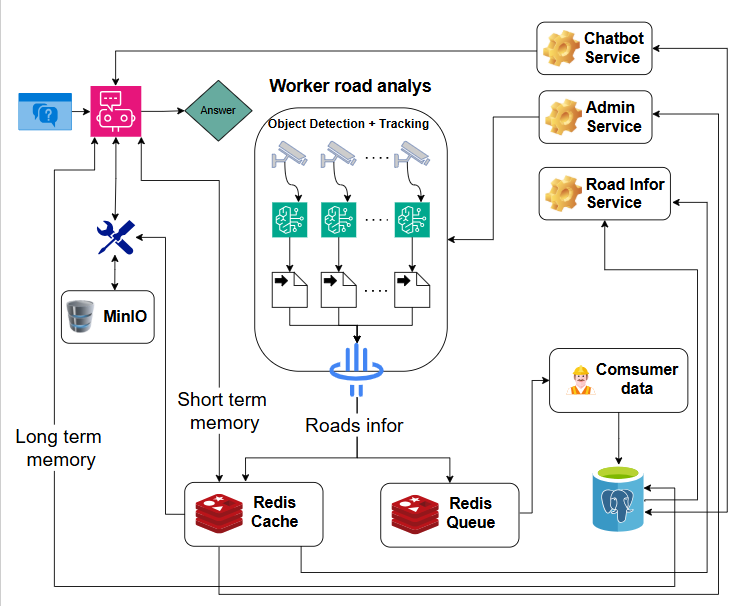

# Hệ Thống Giao Thông Thông Minh (ITS)

**Tác giả:** Hà Nhật Nguyên Vũ — vuhnn6145@gmail.com

Hệ thống giám sát giao thông thông minh sử dụng AI để nhận diện và theo dõi phương tiện theo thời gian thực. Cung cấp dashboard trực quan, REST/WebSocket API, Discord Bot, và AI chatbot hỗ trợ truy vấn bằng ngôn ngữ tự nhiên.

## Architecture Overview



## Short Demo

https://github.com/user-attachments/assets/143d2063-2be7-40d9-a1ea-3e07eed10ddb

## Features

- Real-time vehicle detection and tracking (YOLO + ByteTrack)
- Multi-camera processing with multiprocessing
- Live dashboard with traffic analytics
- REST + WebSocket APIs for realtime data
- WebRTC low-latency video streaming
- AI chatbot (LangGraph ReAct) for natural language queries (Web UI & Discord Bot)
- Discord Bot for real-time traffic queries and live camera snapshot retrieval
- Camera frame snapshots stored in MinIO and distributed via public URL
- Model optimization with INT8 OpenVINO and TensorRT
- Model pruning with torch-pruning
- **Full CPU and GPU (NVIDIA CUDA) support**

## Tech Stack

- **Backend:** FastAPI, Python 3.11
- **Frontend:** React, TypeScript, Vite
- **Cache / Queue:** Redis
- **Object Storage:** MinIO
- **Database:** PostgreSQL 16
- **AI/ML:** YOLO, ByteTrack, LangGraph
- **Bot:** Discord.py
- **Containerization:** Docker, Docker Compose

## GPU Support

The system fully supports NVIDIA GPU acceleration via CUDA 12. When running with GPU:

| Metric | CPU | GPU (RTX 3050) |
|---|---|---|
| Detection speed | ~5-8 FPS | **25-30 FPS** |
| Multi-camera support | 1-2 (laggy) | **3-5 (smooth)** |
| Host CPU usage | 90-100% | **10-15%** |

To enable GPU mode, set `DEVICE=gpu` in your `.env` file and ensure the NVIDIA Container Toolkit is installed on the host machine.

## Requirements

- Docker Desktop with WSL 2 (recommended)
- NVIDIA GPU + NVIDIA Container Toolkit (optional, for GPU mode)
- Python 3.11+ (for manual setup only)
- Node.js 18+ (for manual setup only)

## Setup

### Docker (Recommended)

1. Copy environment files:

   ```powershell
   # Windows PowerShell
   Copy-Item backend/.env.example backend/.env
   ```

2. Edit `backend/.env` to match your local services and secrets.

3. Download sample videos into `backend/app/video_test`:

   ```bash
   cd backend/app
   gdown --folder https://drive.google.com/drive/folders/1gkac5U5jEs174p7V7VC3rCmgvO_cVwxH
   ```

4. Start all services (CPU mode):

   ```bash
   docker compose up --build -d
   ```

5. Start all services (GPU mode — requires NVIDIA Container Toolkit):

   ```bash
   # Set DEVICE=gpu in your .env file, then:
   docker compose up --build -d
   ```

Backend: http://localhost:8000
Frontend: http://localhost:5173
MinIO Console: http://localhost:9001

### Manual Setup

1. Copy and edit environment files (see step 1-2 above).

2. Install backend dependencies:

   ```bash
   cd backend
   pip install -r requirements_cpu.txt   # CPU mode
   # or
   pip install -r requirements_gpu.txt   # GPU mode
   ```

3. Run the backend:

   ```bash
   cd backend
   uvicorn app.main:app --reload --host 0.0.0.0 --port 8000
   ```

4. Install and run the frontend:

   ```bash
   cd frontend
   npm install -g pnpm
   pnpm install
   pnpm run dev
   ```

## MinIO Object Storage

MinIO is used to store vehicle detection camera frame snapshots and serve them as public URLs for the dashboard and Discord Bot.

| Service | URL |
|---|---|
| MinIO Console | http://localhost:9001 |
| MinIO API | http://localhost:9000 |

Default credentials are defined in `backend/.env`:

```env
MINIO_ACCESS_KEY=admin
MINIO_SECRET_KEY=Traffic@123456
```

Frames are automatically uploaded to the `road-frames` bucket when the AI captures a snapshot of a monitored road.

## Main APIs (v1)

Base prefix: `/api/v1`

### REST

**Auth**

- `POST /auth/register` - Create a new account
- `POST /auth/login` - Login and receive JWT
- `GET /auth/me` - Get current user profile

**User**

- `PUT /user/password` - Change password
- `PUT /user/profile` - Update profile info

**Traffic**

- `GET /road/roads_name` - List monitored roads
- `GET /road/info/{road_name}` - Current traffic stats (counts, speeds, status)
- `GET /road/history/{road_name}` - Traffic history (paginated)
- `POST /road/webrtc/offer/{road_name}` - WebRTC session setup (SDP offer -> answer)

**Chat**

- `POST /chatbot/chat` - Send a message to the AI assistant

**Chat History**

- `GET /chat-history/messages` - List chat messages
- `POST /chat-history/messages` - Save a message
- `DELETE /chat-history/messages` - Clear all messages
- `DELETE /chat-history/messages/{message_id}` - Delete a message
- `GET /chat-history/messages/count` - Count messages

**Admin**

- `GET /admin/resources` - System metrics (CPU, RAM, Disk, Network)
- `GET /admin/traffic/status` - Worker status per road
- `POST /admin/traffic/roads/{road_name}/start` - Start a road worker
- `POST /admin/traffic/roads/{road_name}/stop` - Stop a road worker

### Realtime (WebSocket / WebRTC)

- `WS /road/ws/frames/{road_name}` - JPEG frame stream
- `WS /road/ws/info/{road_name}` - Realtime traffic metrics
- `WS /road/ws/chart/{road_name}` - Realtime chart data
- `WS /chatbot/ws/chat` - Realtime chat stream
- `POST /road/webrtc/offer/{road_name}` - WebRTC signaling for low-latency video

## Authentication

Most endpoints require JWT. Admin endpoints require admin role.

Header:

```
Authorization: Bearer <TOKEN>
```

WebSocket query:

```
?token=<TOKEN>
```

## API Docs

Swagger UI: http://localhost:8000/docs

## Discord Bot Integration

The system includes a Discord Bot that acts as a natural language interface to the traffic AI assistant.

### Bot Capabilities

- **Real-time Queries**: Ask the bot about traffic conditions using natural language.
- **Visual Feedback**: The bot retrieves live camera snapshots and sends them as image attachments.
- **Commands**:
  - `!giaothong <câu hỏi>`: Ask AI about traffic (e.g. `!giaothong Đường Nguyễn Trãi đang tắc không?`).
  - `!help_its`: Show usage instructions and example queries.

### Setup and Configuration

To enable the Discord bot:

1. Create a Discord application in the [Discord Developer Portal](https://discord.com/developers/applications).
2. Create a bot user, copy the **Bot Token**, and enable **Message Content Intent** under the Bot tab.
3. Configure the token in `backend/.env`:

   ```env
   DISCORD_BOT_TOKEN=your_token_here
   ```

4. Restart the backend container:

   ```bash
   docker compose up -d
   ```

The bot will automatically connect and log in on startup.
