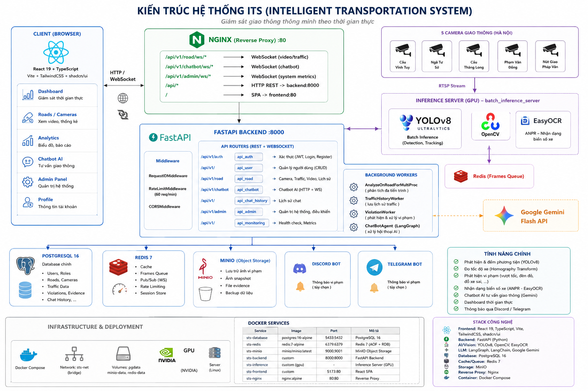

<div align="center">

# 🚦 Smart Transportation System (ITS)

**Hệ thống giám sát và phân tích giao thông thông minh theo thời gian thực**

[](https://python.org)
[](https://fastapi.tiangolo.com)
[](https://react.dev)
[](https://typescriptlang.org)
[](https://docker.com)
[](LICENSE)

*Tác giả:* **Hà Nhật Nguyên Vũ** — vuhnn6145@gmail.com

</div>

---

## 📖 Tổng quan

**Smart Transportation System (ITS)** là nền tảng giám sát giao thông đô thị ứng dụng AI, được xây dựng theo kiến trúc Microservices hoàn chỉnh. Hệ thống phân tích video từ **5 camera** giao thông tại Hà Nội theo thời gian thực, cung cấp dữ liệu đếm lưu lượng, ước tính vận tốc phương tiện, và hỗ trợ điều hành thông qua dashboard quản trị và trợ lý AI.

---

## 🖼️ Kiến trúc hệ thống



---

## ✨ Tính năng nổi bật

### 🤖 AI & Phân tích Video
- **Nhận diện phương tiện thời gian thực** — YOLOv8 custom-trained cho giao thông Việt Nam (ô tô, xe máy)
- **Theo dõi đa đối tượng** — ByteTrack (CPU) / BoT-SORT (GPU với ReID)
- **Đo tốc độ** — Biến đổi Homography (pixel → mét thực tế), làm trơn EMA để giảm nhiễu
- **Nhận dạng biển số (ANPR)** — EasyOCR với pipeline tăng độ nét ảnh (CLAHE → Blur → Sharpen)
- **Tối ưu mô hình** — Xuất INT8 (OpenVINO, TensorRT), pruning với torch-pruning

### 📡 Streaming & Realtime
- **WebRTC low-latency** — Truyền phát video độ trễ thấp Peer-to-Peer trực tiếp đến trình duyệt
- **WebSocket** — Cập nhật dữ liệu traffic, biểu đồ, và chat theo luồng không đồng bộ
- **Đa camera** — Xử lý song song 5 luồng camera bằng `multiprocessing`

### 🤝 AI Chatbot (LangGraph ReAct)
- Hỏi đáp bằng **ngôn ngữ tự nhiên** (Tiếng Việt) về tình trạng giao thông hiện tại
- Truy xuất **ảnh camera thời gian thực** qua MinIO
- **Bộ nhớ ngắn hạn** (Redis) và **dài hạn** (PostgreSQL Semantic Store)
- Giao diện Web UI tích hợp và **Discord Bot** (`!giaothong <câu hỏi>`)

### 🛡️ Admin Dashboard
- Giám sát tài nguyên server **CPU / RAM / Disk** theo thời gian thực
- Bật / Tắt từng luồng camera AI **độc lập** mà không cần restart toàn bộ hệ thống
- Kiểm soát truy cập dựa trên vai trò (**Role-based access control**)

---

## ⚡ GPU vs CPU Performance

| Chỉ số | CPU Mode | GPU Mode (RTX 3050) |
|---|---|---|
| Tốc độ xử lý | ~5-8 FPS | **25-30 FPS** |
| Số camera đồng thời | 1-2 (giật) | **3-5 (mượt)** |
| CPU host usage | 90-100% | **10-15%** |

---

## 🏗️ Tech Stack

| Lớp | Công nghệ |
|---|---|
| **Frontend** | React 19 + TypeScript + Vite + TailwindCSS v4 + shadcn/ui |
| **Backend** | FastAPI (Python 3.11) + SQLAlchemy async + Alembic |
| **AI / Vision** | YOLOv8 (Ultralytics) + ByteTrack / BoT-SORT + OpenCV |
| **LLM / Chatbot** | LangGraph ReAct + LangChain + Google Gemini Flash |
| **Database** | PostgreSQL 16 |
| **Cache / Queue** | Redis 7 (AOF + RDB, Pub/Sub) |
| **Object Storage** | MinIO (S3-compatible) |
| **Reverse Proxy** | Nginx Alpine |
| **Container** | Docker Compose |
| **Bot** | Discord.py |

---

## 🗂️ Cấu trúc dự án

```
Project ITS/
├── backend/
│   ├── app/
│   │   ├── ai_models/          # YOLOv8 weights (.pt, .onnx, .mnn, OpenVINO...)
│   │   ├── api/v1/             # FastAPI routers (auth, road, chatbot, admin...)
│   │   ├── core/               # Config, middleware, ANPR engine, Rate limiter
│   │   ├── models/             # SQLAlchemy ORM models
│   │   ├── services/
│   │   │   ├── road_services/  # Video analysis pipeline, Violation & Traffic workers
│   │   │   └── chat_services/  # LangGraph chatbot agent
│   │   ├── utils/              # JWT, MinIO, WebRTC, polygon utils
│   │   └── main.py             # FastAPI entry point
│   ├── alembic/                # Database migrations
│   └── .env.example
├── frontend/
│   ├── src/
│   │   ├── pages/              # LoginPage, AnalyticsPage, ChatPage, Admin...
│   │   ├── hooks/              # useWebSocket, useWebRTC, useAdminGuard
│   │   └── modules/features/   # Feature modules (traffic, chat, auth, video)
│   └── vite.config.ts
├── nginx/nginx.conf            # Reverse proxy routing
├── docker-compose.yml
└── ARCHITECTURE.md             # Tài liệu kiến trúc chi tiết
```

---

## 🚀 Cài đặt & Chạy

### Yêu cầu
- Docker Desktop (WSL 2 trên Windows)
- *(Tùy chọn)* NVIDIA GPU + NVIDIA Container Toolkit để chạy GPU mode

### Bước 1 — Cấu hình môi trường

```powershell
# Windows PowerShell
Copy-Item backend/.env.example backend/.env
```

Mở `backend/.env` và điền các thông số: `DATABASE_*`, `JWT_SECRET_KEY`, `GOOGLE_API_KEY`, v.v.

### Bước 2 — Tải video test

```bash
cd backend/app
gdown --folder https://drive.google.com/drive/folders/1gkac5U5jEs174p7V7VC3rCmgvO_cVwxH
```

### Bước 3 — Khởi động hệ thống

```bash
# CPU mode (mặc định)
docker compose up --build -d

# GPU mode (cần NVIDIA Container Toolkit)
# Đặt DEVICE=gpu trong .env, sau đó:
docker compose up --build -d
```

| Dịch vụ | URL |
|---|---|
| Frontend | http://localhost (qua Nginx) hoặc http://localhost:5173 |
| Backend API | http://localhost:8000 |
| Swagger UI | http://localhost:8000/docs |
| MinIO Console | http://localhost:9001 |

---

## 🔌 API chính (v1)

**Base prefix:** `/api/v1`

### REST Endpoints

| Module | Endpoint | Mô tả |
|---|---|---|
| **Auth** | `POST /auth/login` | Đăng nhập, nhận JWT |
| | `POST /auth/register` | Tạo tài khoản mới |
| | `GET /auth/me` | Lấy thông tin người dùng hiện tại |
| **Traffic** | `GET /road/roads_name` | Danh sách 5 tuyến đường giám sát |
| | `GET /road/info/{road_name}` | Thống kê traffic realtime (đếm xe, tốc độ) |
| | `GET /road/history/{road_name}` | Lịch sử lưu lượng (phân trang) |
| | `POST /road/webrtc/offer/{road_name}` | Thiết lập phiên WebRTC (SDP offer/answer) |
| **Chatbot** | `POST /chatbot/chat` | Gửi tin nhắn đến AI assistant |
| **Admin** | `GET /admin/resources` | CPU / RAM / Disk của server |
| | `GET /admin/traffic/status` | Trạng thái từng luồng camera |
| | `POST /admin/traffic/roads/{road}/start` | Bật luồng camera AI |
| | `POST /admin/traffic/roads/{road}/stop` | Tắt luồng camera AI |

### WebSocket / WebRTC

```
WS  /road/ws/frames/{road_name}   → Luồng JPEG frames realtime
WS  /road/ws/info/{road_name}     → Thống kê traffic (count, speed, status)
WS  /road/ws/chart/{road_name}    → Dữ liệu time-series cho biểu đồ
WS  /chatbot/ws/chat              → Chat streaming
WS  /admin/ws/resources           → CPU/RAM/Disk realtime
```

---

## 🔐 Xác thực

Các endpoint cần JWT. Admin endpoint yêu cầu `role_id = 0`.

```http
# HTTP Header
Authorization: Bearer <TOKEN>

# WebSocket query param
?token=<TOKEN>
```

---

## 🤖 Discord Bot

```bash
# Cấu hình trong backend/.env
DISCORD_BOT_TOKEN=your_token_here
DISCORD_ALERTS_ENABLED=true
```

**Câu lệnh:**
- `!giaothong <câu hỏi>` — Hỏi AI về tình trạng giao thông (ví dụ: `!giaothong Đường Láng đang thế nào?`)
- `!help_its` — Hiển thị hướng dẫn sử dụng

---

## 📊 5 Tuyến đường giám sát (Hà Nội)

| Tuyến | Giới hạn tốc độ | Ngưỡng đông / tắc |
|---|---|---|
| Văn Quán | 40 km/h | 8 / 15 xe |
| Nguyễn Văn Trỗi | 60 km/h | 12 / 23 xe |
| Nguyễn Trãi | 60 km/h | 12 / 22 xe |
| Ngã Tư Sở | 40 km/h | 35 / 47 xe |
| Đường Láng | 60 km/h | 12 / 20 xe |

---

## 📚 Tài liệu

- [ARCHITECTURE.md](./ARCHITECTURE.md) — Kiến trúc chi tiết, sơ đồ luồng dữ liệu, mô tả từng module
- [Swagger UI](http://localhost:8000/docs) — API reference đầy đủ (chạy local)

---

<div align="center">

Made with ❤️ by **Hà Nhật Nguyên Vũ**

*Chuyên đề Hệ thống Giao thông Thông minh — 2026*

</div>
